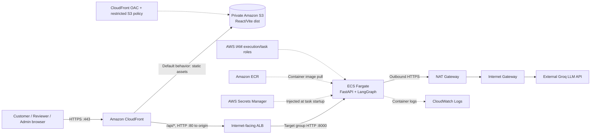
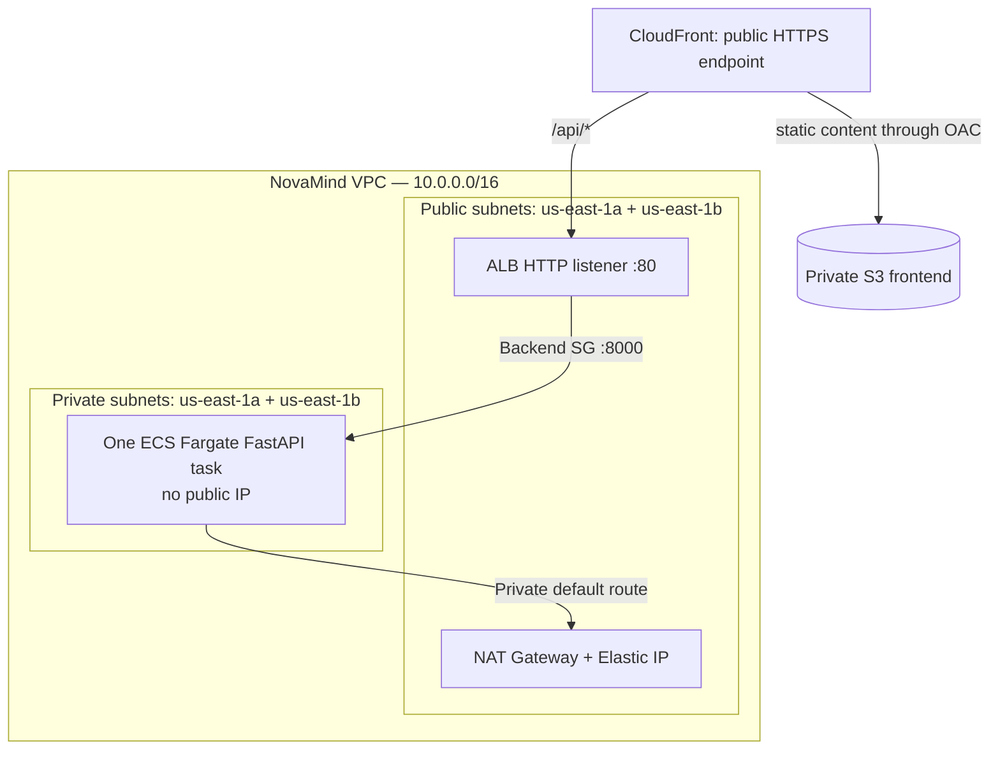
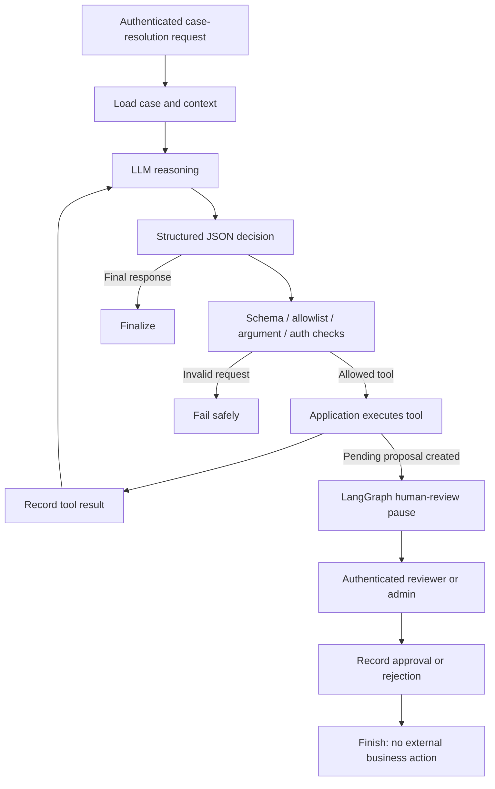
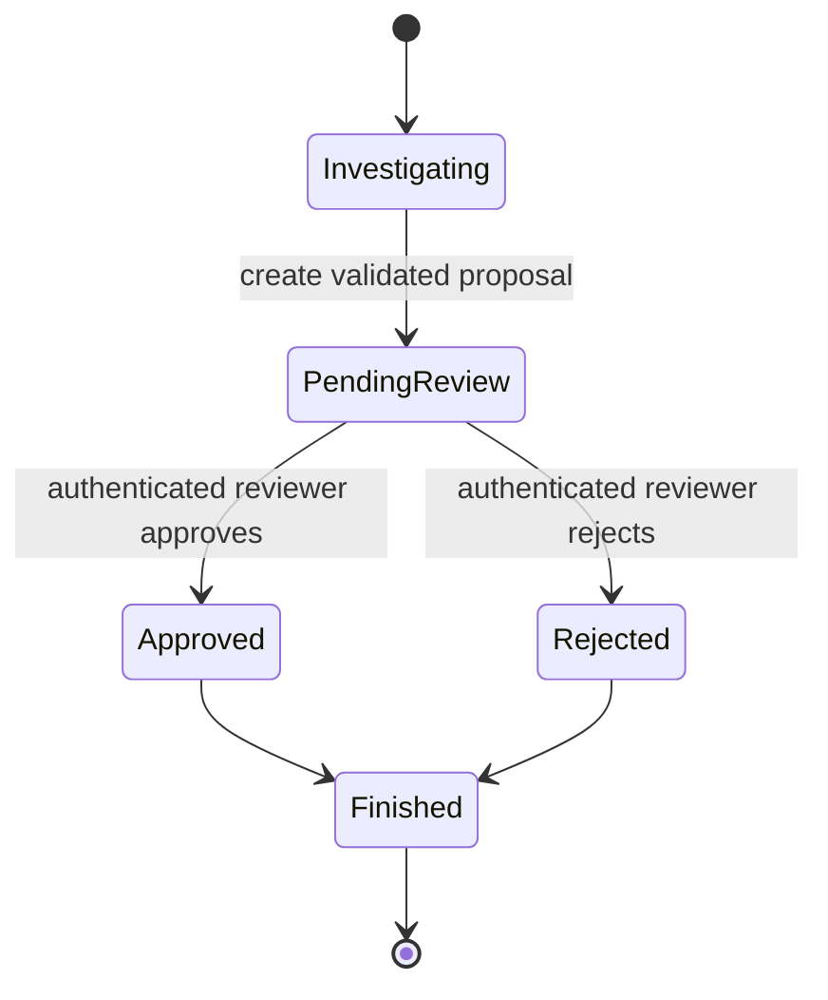
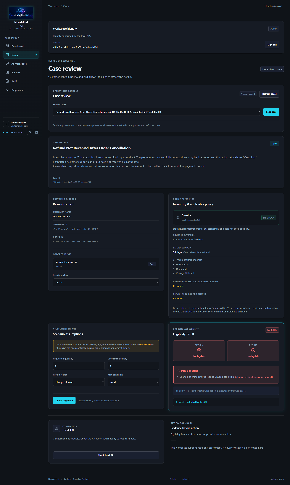

<div align="center">

# NovaMind Agentic Customer Resolution Platform

### Built by Aamir

**An AWS-deployed, bounded Agentic AI platform for evidence-based customer-case investigation, structured resolution proposals, and human approval.**


**[Open the CloudFront demo](https://d26tisze27u224.cloudfront.net/)** · **[Architecture](#6-current-aws-cloudfront-architecture)** · **[Case walkthrough](#16-end-to-end-example-damaged-laptop)** · **[Interview guide](#23-how-to-explain-novamind-in-an-interview)**

> **Deployment status (verified during October 2026 deployment):** CloudFront distribution was deployed, the private-S3 website became accessible, and the ECS backend had a healthy ALB target. Availability is not continuously monitored, and the live demo may be offline or incur costs when running.

</div>

---

## Table of contents

1. [Executive summary](#1-executive-summary)
2. [Problem statement](#2-the-problem-we-are-solving)
3. [Why I built it](#3-why-i-built-novamind)
4. [Who uses NovaMind and why](#4-who-uses-novamind-and-why)
5. [Core capabilities and boundaries](#5-core-capabilities-and-boundaries)
6. [Current AWS CloudFront architecture](#6-current-aws-cloudfront-architecture)
7. [AWS services and their connections](#7-aws-services-and-their-connections)
8. [End-to-end network and request flows](#8-end-to-end-network-and-request-flows)
9. [Agentic AI architecture](#9-agentic-ai-architecture)
10. [Controlled tool layer](#10-controlled-tool-layer)
11. [Business rules and human review](#11-deterministic-business-rules-and-human-review)
12. [Knowledge retrieval and grounding](#12-knowledge-retrieval-and-grounding)
13. [Technology stack](#13-technology-stack)
14. [Authentication, authorization and security](#14-authentication-authorization-and-security)
15. [How the application is deployed](#15-how-the-application-is-deployed)
16. [Damaged-laptop case walkthrough](#16-end-to-end-example-damaged-laptop)
17. [Application screenshots](#17-application-screenshots)
18. [Engineering challenges and solutions](#18-engineering-challenges-and-solutions)
19. [Monitoring and verification](#19-monitoring-and-verification)
20. [Reliability, scalability and cost](#20-reliability-scalability-and-cost)
21. [Current limitations and production readiness](#21-current-limitations-and-production-readiness)
22. [Future engineering roadmap](#22-future-engineering-roadmap)
23. [Interview preparation](#23-how-to-explain-novamind-in-an-interview)
24. [Repository, documentation and credits](#24-repository-documentation-and-credits)

---


## 1. Executive summary

**NovaMind** is a bounded Agentic AI customer-resolution application. It helps support teams investigate issues such as a damaged laptop, an incorrect item, a possible return, or a replacement request. Rather than trusting a model to invent a decision or directly change business systems, NovaMind combines:

- **Groq-hosted LLM reasoning:** interprets the support problem and selects a *requested* next step.
- **Application-managed tools:** securely look up case, customer, order, policy, inventory, eligibility and knowledge information.
- **Deterministic rules:** Python code performs authoritative checks instead of relying on an LLM's interpretation of a policy.
- **LangGraph orchestration:** expresses multi-step reasoning, conditional routes, limits, and a pause for human review.
- **Human-in-the-Loop (HITL):** an authenticated reviewer or administrator can approve or reject a proposed resolution.
- **AWS deployment:** React/Vite assets are delivered from private S3 via CloudFront; FastAPI/LangGraph runs as a container in private ECS Fargate networking behind an ALB.

The critical design principle is:

> **The LLM may reason and propose. Application code validates and enforces rules. An authenticated human authorizes sensitive decisions.**

**Not a payment/refund fulfillment system:** The present implementation **does not** actually issue refunds, ship replacement products, arrange pickups, charge cards or mutate external inventory. Approval is recorded; real-world **EXECUTE** and **VERIFY** stages remain future work.

### At a glance

| Dimension | Current implementation |
|---|---|
| Product | Customer case investigation and proposal review |
| UI | React + Vite static single-page frontend |
| Public endpoint | Amazon CloudFront HTTPS |
| Static hosting | Private Amazon S3, accessed through Origin Access Control (OAC) |
| API | Python FastAPI/Uvicorn, port `8000` |
| Container runtime | ECS Fargate, one running backend task in verified deployment |
| API routing | CloudFront `/api/*` → internet-facing ALB HTTP port `80` → ECS target port `8000` |
| AI orchestration | Bounded agent loop, LangGraph and HITL workflow |
| LLM endpoint | External Groq API; configured model `openai/gpt-oss-20b` |
| Reference retrieval | Local lexical/token-cosine retrieval; **not** a vector-database RAG service |
| App state | Some runtime/business/workflow state is process-local; not durable HA |
| Authentication | Server-configured bearer credentials with CUSTOMER, REVIEWER and ADMIN roles |
| Monitoring | ECS application logs in Amazon CloudWatch Logs |
| Region | `us-east-1` |

## 2. The problem we are solving

A customer may report: **“My new laptop has a cracked screen and a broken hinge. Can I get a replacement?”** A support agent cannot safely answer from the message alone. They need to verify the associated customer, purchase, delivery evidence, applicable policy, return window, inventory and authorization rules.

In a traditional process, an agent manually switches between support cases, order-management tools, inventory systems and policy documents. This creates risks: slow handling, inconsistent interpretations, missing evidence, weak traceability and unauthorized decisions.

A basic chatbot makes a different mistake: it may generate a fluent reply without verifying facts, or promise a refund that no business system approved. **NovaMind separates investigation and recommendation from authorization and execution.** The project demonstrates how to automate parts of case investigation without giving an LLM unrestricted control of business processes.

**Expected benefits** (design objectives, not measured production KPIs):

| Business need | NovaMind approach |
|---|---|
| Reduce repeated lookups | Allowlisted lookup tools invoked as needed |
| Improve policy consistency | Deterministic eligibility checks |
| Reduce unsupported claims | Use records and retrieved reference evidence |
| Keep sensitive actions controlled | Human-reviewed proposals |
| Make decisions explainable | Trace IDs, tool steps and proposal/review state |
| Support engineering changes | Provider abstraction, modular FastAPI and LangGraph components |

## 3. Why I built NovaMind

This project explores a practical question: **How can a business use Agentic AI for complex decisions while retaining control over customer data, authorization and irreversible actions?**

I chose customer support because damaged products, replacement requests and return eligibility are concrete workflows that combine ambiguous natural-language requests with structured data and rules. They are realistic enough to require multiple steps, but sensitive enough to justify clear AI boundaries.

Engineering goals:

1. Build a **tool-using AI agent**, not merely prompt → answer generation.
2. Make **tool selection and arguments inspectable and validated** by application code.
3. Use **LangGraph** for explicit state, conditional routing and HITL pausing.
4. Keep **eligibility calculations deterministic** and auditable.
5. Create a complete **React + FastAPI** application for customer and reviewer interactions.
6. Deploy a secure learning/demo architecture using **CloudFront, S3, ALB, ECS Fargate, Secrets Manager and CloudWatch**.
7. Document limitations clearly so the project can be defended in an engineering interview.

## 4. Who uses NovaMind and why

| Role | Activities | Trust boundary |
|---|---|---|
| **CUSTOMER** | Views or creates relevant cases and checks their status | Cannot access other customers' records |
| **REVIEWER** | Investigates cases, examines AI proposals, approves or rejects within permissions | Human identity comes from backend authentication |
| **ADMIN** | Performs privileged review/diagnostics available to the role | Cannot grant authority to the LLM merely through a prompt |
| **Engineering/support operations** | Debugs failures using safe workflow information and CloudWatch logs | Operational logs must not expose credentials |
| **Mentor/demo viewer** | Can observe a demonstration when explicitly given appropriate access | Demo access is not a separate proven production identity system |

The repository is a **portfolio and engineering demonstration**, not a production merchant integration. There are no claims of measured reductions in handling time, real processed refunds, or real customer revenue.

## 5. Core capabilities and boundaries

| Capability | What it does | Reality check |
|---|---|---|
| Case management | Presents customer cases and case-related context | Demo/application data; current state may be in memory |
| Role checks | Protects customer, reviewer and admin operations | Bearer registry today, not Cognito/OIDC |
| Agentic investigation | Uses a bounded multi-step reasoning loop | LLM can request only permitted tools |
| Structured decision output | Parses and validates model-generated tool/final decisions | Model output is untrusted |
| Case/order/customer lookup | Reads domain records through application tools | Not a live external CRM/ERP integration |
| Knowledge lookup | Retrieves ranked local text snippets with source identifiers | Lexical retrieval, not vector DB |
| Eligibility checks | Uses deterministic Python business rules | Policies are demonstration policy data/rules |
| Proposal generation | Creates structured pending resolution proposals | Proposal does not execute a refund/replacement |
| HITL approval | Reviewer/admin can approve or reject | Reviewer authorization enforced in backend |
| Observability | Captures safe request/workflow/tool metadata | Infrastructure and business health checked separately |
| CloudFront delivery | HTTPS website + API behavior with separate origins | Verified deployment; not proof of complete origin TLS |

The long-term workflow is **PROPOSE → AUTHORIZE → EXECUTE → VERIFY**. This version intentionally implements the first two stages only.

## 6. Current AWS CloudFront architecture

## AWS CloudFront Deployment Architecture

**Built by Aamir**


### Built by Aamir — deployed architecture

<!-- Verify that this exact filename exists in the GitHub project-pic/ directory. -->


**Source of truth:** This diagram is an architectural visual. The text and verified resource inventory below define the actual October 2026 deployment; illustration labels are not live AWS evidence.

### Infrastructure flow (GitHub-renderable diagram)



### Architecture boundaries



**Important TLS qualification:** Browser → CloudFront is HTTPS. The presently configured **CloudFront → ALB origin uses HTTP :80**, and ALB → ECS uses HTTP :8000. Therefore, do **not** describe this deployment as end-to-end TLS. HTTPS at the edge protects browser traffic but is not equivalent to HTTPS all the way to the backend.

### Verified deployment identifiers (historical; do not reuse blindly)

| Resource | Deployment identifier |
|---|---|
| Account / region / CLI profile | `357001292388` / `us-east-1` / `novamind` |
| CloudFront distribution | `EHJ4CWH1Z6Q0P` |
| CloudFront HTTPS domain | `https://d26tisze27u224.cloudfront.net/` |
| CloudFront OAC | `E2528519T6EQVH` |
| Private S3 frontend bucket | `novamind-frontend-357001292388` |
| VPC | `vpc-05500a2fafcf71c1a` (`10.0.0.0/16`) |
| Public subnets (1a / 1b) | `subnet-0f731a2ad6eea7cd5` / `subnet-0784c0638221c7bb2` |
| Private subnets (1a / 1b) | `subnet-0422217f287ed8347` / `subnet-05e31d5f9870e0513` |
| Internet Gateway | `igw-0848e8277a98862e9` |
| NAT Gateway / public IP | `nat-0ccd5334643720b94` / `44.205.128.130` |
| Public / private route tables | `rtb-06c651024b1b420d6` / `rtb-0a5a9464043f6f127` |
| ALB / DNS | `novamind-alb` / `novamind-alb-1683033182.us-east-1.elb.amazonaws.com` |
| ALB / backend security groups | `sg-04d55bbc9a34f24e3` / `sg-0bc040b7d043a7f40` |
| CloudFront origin-facing prefix list | `pl-3b927c52` |
| ECS cluster / service | `novamind` / `novamind-backend-service` |
| ECS task family/revision | `novamind-backend:3` |
| Backend target group | `novamind-backend-tg` (HTTP :8000; `/api/health`) |
| ECR repository | `357001292388.dkr.ecr.us-east-1.amazonaws.com/novamind-backend` |
| Backend immutable image digest | `sha256:a147c3f75ea91e04c8d324e512b7add838336b8c5d69392e18809edd8dcecf4f` |
| CloudWatch log group | `/ecs/novamind-backend` (7-day retention) |

> The AWS IDs above belong to a particular deployment, are **not secrets**, and are not guaranteed to remain current. Verify ownership and live state before creating, editing or deleting resources. A fresh deployment will generate different IDs. Access tokens, API keys and auth JSON must **never** appear in this README.

### What changed from the previous ALB-only version?

| Older deployment / README | Latest deployed design |
|---|---|
| Browser reached public ALB over HTTP | Browser reaches CloudFront via HTTPS |
| ALB handled both `/` and `/api/*` | CloudFront sends frontend paths to S3; `/api/*` to ALB |
| React/Nginx frontend ran as an ECS service | Vite static build is served from private S3 |
| Two ECS application services | One verified backend ECS Fargate service |
| Frontend and backend ECR images needed | Only backend ECR image is required for this deployed topology |
| CloudFront was blocked/planned | Distribution created and reached `Deployed` |
| CloudFront OAC not active in the old deployment | OAC + distribution-specific bucket policy used |

The earlier ALB/ECS frontend architecture is **historical**, not the currently documented cloud delivery path. Older screenshots, container examples and parts of the original README refer to that former design.

## 7. AWS services and their connections

| Service | Why it is used | Connected to |
|---|---|---|
| **CloudFront** | Public HTTPS entry point; caches frontend assets and routes API paths | Browser, private S3, ALB |
| **S3** | Stores React/Vite production files without hosting a public bucket website | CloudFront via OAC |
| **Origin Access Control** | SigV4-signed CloudFront requests to private S3 | Distribution and S3 bucket policy |
| **Amazon VPC** | Network boundary for application traffic | ALB, ECS, subnets, gateways, SGs |
| **Public subnets (2 AZs)** | ALB placement; public NAT Gateway | IGW via public route table |
| **Private subnets (2 AZs)** | No-public-IP ECS backend placement | ALB ingress, NAT outbound |
| **Internet Gateway** | Internet access for suitable public resources | Public route table, NAT traffic |
| **NAT Gateway** | Outbound internet for private ECS, including Groq | Private route table, public subnet, IGW |
| **Elastic IP** | NAT Gateway public IPv4 address | NAT Gateway |
| **ALB** | Receives CloudFront `/api/*` requests and forwards to backend target | CloudFront, target group, ECS |
| **Target group** | Registers ECS task private IP/port and probes `/api/health` | ALB listener, ECS service |
| **ECS** | Runs/maintains desired backend service | Fargate, target group, task definition |
| **AWS Fargate** | Managed container compute without managing EC2 hosts | ECS service, private subnet ENIs |
| **ECR** | Stores backend Docker image | ECS image pull |
| **IAM** | Governs execution-time AWS permissions | ECS execution role, task role |
| **Secrets Manager** | Holds Groq API key and auth configuration | ECS startup secret injection |
| **CloudWatch Logs** | Centralized backend stdout/stderr logging | ECS awslogs driver |
| **Groq** (external) | LLM reasoning; not an AWS Bedrock model in this release | FastAPI through NAT/outbound HTTPS |

### Why two Availability Zones if there is only one backend task?

The ALB spans two AZs and the VPC has a two-AZ network layout. This provides a foundation for resilient routing, **not** proof of application high availability. The service was verified at **desired = 1, running = 1**. Important application state is local to the running process. Scaling to two tasks without externalizing that state can split cases, checkpoints or proposal records between tasks.

### Security group logic

- ALB SG permits **TCP 80** from AWS's managed **CloudFront origin-facing** prefix list (`pl-3b927c52`).
- Backend ECS SG permits **TCP 8000** only from the ALB SG.
- ECS Fargate tasks receive **no public IP**.
- CloudFront uses **HTTPS for viewer requests**, but **HTTP-only** to the current ALB origin.
- CloudFront origin-facing IP restrictions are **not a distribution-specific authentication mechanism**; another CloudFront distribution may potentially reach the origin unless further origin controls are added.

## 8. End-to-end network and request flows

### A. Static frontend request

1. Customer opens `https://d26tisze27u224.cloudfront.net/`.
2. Browser establishes HTTPS to CloudFront.
3. Default CloudFront behavior selects the private S3 REST origin.
4. CloudFront signs the S3 request using its configured OAC.
5. The S3 bucket policy authorizes `s3:GetObject` to that CloudFront distribution's service principal and SourceArn.
6. CloudFront returns `index.html`, JavaScript, CSS and image assets.
7. React runs in the browser; **no frontend Fargate container is needed** in this architecture.

### B. Application API request

1. React sends a same-host request such as `/api/health` or an authenticated case request.
2. CloudFront matches its `/api/*` behavior, with API caching disabled.
3. The request is forwarded to the ALB origin using **HTTP port 80**, with appropriate viewer request data forwarded per configuration (including `Authorization` where needed).
4. ALB listener forwards to the backend IP target group on **HTTP port 8000**.
5. ECS Fargate FastAPI handles authentication, authorization, validation and business logic.
6. Response returns **ECS → ALB → CloudFront → HTTPS browser**.

### C. AI request / inference

1. An authorized workflow request starts an agent run in FastAPI.
2. The backend assembles case context and permitted tool descriptions.
3. The Groq adapter sends a structured model request over outbound HTTPS.
4. Because ECS is in a private subnet, the network path traverses the private default route → NAT Gateway → public subnet/IGW → Groq.
5. Model output is parsed, validated and dispatched **only** through application-managed tools.
6. The agent may gather further evidence, evaluate rules or create a pending proposal.
7. A reviewer/admin performs the review step if required; the application returns the recorded result to the UI.

### D. Backend image deployment

```text
Docker build (backend/ context)
   ↓
Tag and push to private Amazon ECR
   ↓
Resolve immutable image digest
   ↓
Register ECS Fargate task definition
   ↓
Create/update ECS service in private subnets
   ↓
Pull from ECR + inject secrets + start Uvicorn
   ↓
Register target private IP with ALB target group
   ↓
ALB health probe GET /api/health → 200
```

### E. Logging and startup secrets

The **ECS task execution role** gives ECS permission to pull from ECR, write logs to CloudWatch and resolve the two configured Secrets Manager values. Groq and authentication contents enter the task environment rather than a Git-tracked file. The backend's ECS entrypoint writes the auth content to `/dev/shm/novamind/auth.json` and points its auth loader there. The image runs as a non-root user with a **read-only root filesystem**. Startup metadata and application logs go to `/ecs/novamind-backend` (configured 7-day retention). Avoid logging auth headers or tokens.

## 9. Agentic AI architecture

### Why this is more than a chatbot

A traditional chatbot may answer directly from a prompt. NovaMind implements a bounded, stateful **plan/select tool → execute approved operation → observe result → continue** loop. An LLM can request a next step; it **cannot authorize itself**, invent new tools, or call arbitrary business APIs.



### Application components described in the original repository README

| Component | Responsibility |
|---|---|
| `backend/app/agent.py` | Explicit iterative agent decision loop |
| `backend/app/graph_agent.py` | LangGraph nodes, state and conditional routing |
| `backend/app/hitl.py` | Pause/resume and reviewer decision boundary |
| `backend/app/tools.py` | Allowlisted lookup and proposal tools |
| `backend/app/knowledge.py` | Local reference knowledge retrieval |
| `backend/app/guardrails.py` | Application-level safety validation |
| `backend/app/security.py` | Authentication, role and ownership checks |
| `backend/app/proposals.py` | Proposal lifecycle |
| `backend/app/observability.py` | Safe trace/event metadata |
| `backend/app/groq.py` | External Groq provider adapter |
| `backend/app/gemini.py` | Alternative implemented adapter; not the current deployed provider |
| `backend/container/ecs_entrypoint.py` | ECS auth material setup and API startup |

> These code paths and behaviors are documented by the uploaded original README. A separate source-code audit would be needed to re-confirm their contents against the current checked-out commit.

### Structured decisions and bounded execution

A representative **tool request** concept:

```json
{
  "decision": {
    "kind": "tool",
    "name": "get_order",
    "arguments": {"order_id": "ORDER-EXAMPLE"}
  }
}
```

The application parses and validates the decision, checks that `get_order` is allowlisted, checks argument types and caller access, then invokes the Python tool. The model does **not** execute arbitrary network operations directly. A final response is also modeled as a structured decision. Unknown tools, invalid arguments and disallowed access are rejected safely. The workflow is bounded by step/operation limits rather than permitted to loop indefinitely.

### LangGraph and HITL

The original README describes both a graph-based resolution workflow and a HITL extension. Typical stages include **load_case → reason → execute_tool → record_result → reason**, with conditional transitions to **finalize** or **fail_safely**. A created proposal can lead to a pause for authenticated human review. The reviewer identity comes from the application backend, not from a string generated by the LLM.

## 10. Controlled tool layer

The documented allowlist is:

| Tool | Purpose | May create a business-effecting record? |
|---|---|---|
| `get_customer` | Customer lookup | No |
| `get_order` | Order lookup | No |
| `get_case` | Case lookup | No |
| `get_inventory` | Inventory lookup | No |
| `get_policy` | Reference demonstration policy lookup | No |
| `search_knowledge` | Find relevant local reference chunks | No |
| `assess_eligibility` | Execute deterministic eligibility rules | No |
| `create_resolution_proposal` | Create a *pending* proposed resolution | **Yes: proposal record only** |
| `get_proposal_status` | Read review/proposal status | No |

There is no approved tool for `issue_refund`, `ship_replacement`, `schedule_pickup`, `charge_card` or unrestricted `modify_inventory`. Tool outputs and retrieved text are treated as evidence, not permission to bypass authorization.

## 11. Deterministic business rules and human review

### Why not let the LLM decide eligibility?

Return windows, quantity limits and policy requirements must be repeatable. A language model can misunderstand a policy or invent missing facts. For this reason, the source README describes deterministic checks such as:

- requested item belongs to the order;
- requested quantity is within what was purchased;
- request is within the permitted return window;
- reason and item condition satisfy the configured rule.

The LLM can determine **when to ask** for an eligibility check; Python services determine **what the rules return**. Eligibility also does **not** automatically grant authorization.

### Proposal → human review → stop



A proposal may be marked `PENDING_REVIEW`, with REVIEWER or ADMIN authority required to approve or reject. **The completed review does not trigger an actual shipment, refund or inventory mutation in this version.** The safety invariant is that business execution remains out of scope.

## 12. Knowledge retrieval and grounding

The existing implementation has a **local retrieval-augmented reference** capability, accessed via `search_knowledge`:

1. Read curated local knowledge data, described in the source as JSON documents.
2. Work with bounded text chunks and token-based features.
3. Rank candidates using cosine similarity.
4. Return top-k snippets with source/chunk metadata.
5. Treat all retrieved text as **untrusted informational context**.

The source calls this retrieval approach **`local_token_cosine_v1`**. It is **not** a deployed embedding service, Qdrant cluster, OpenSearch vector collection, or managed Bedrock Knowledge Base. Those are possible future integrations. A source snippet cannot grant reviewer authority, change a rule, or create new tools.

## 13. Technology stack

| Layer | Technologies | Notes |
|---|---|---|
| Web frontend | React, Vite, JavaScript, CSS | Built into S3 static assets for current AWS deployment |
| API/backend | Python 3.12, FastAPI, Uvicorn, Pydantic, HTTPX | Single backend Fargate application |
| Agent runtime | LangGraph and application-managed Python tools | Bounded tool and HITL flows |
| Model provider | Groq, OpenAI-compatible HTTP adapter | Current deployed LLM configuration |
| Alternate model adapter | Gemini | Present in documented code, not the currently deployed provider |
| Local data/retrieval | Local domain services, JSON knowledge, token cosine | Some deployed state is process-local |
| Containers | Docker | Current AWS topology needs backend container on Fargate |
| AWS edge/static | CloudFront, S3, OAC | Viewer HTTPS and private frontend |
| AWS compute/network | ECS Fargate, ECR, ALB, VPC, subnets, NAT/IGW, security groups | Backend deployment and controlled network paths |
| AWS operations | IAM, Secrets Manager, CloudWatch Logs | Execution roles, secrets and logging |
| Local development | Docker Compose (including overlays), optional Nginx frontend container | Different from S3/CloudFront production build |

## 14. Authentication, authorization and security

### Identity model

The source README documents three roles: **CUSTOMER**, **REVIEWER**, **ADMIN**. Current ECS authentication is configured through a trusted bearer-credential registry injected from Secrets Manager. Authentication is **not** an Amazon Cognito, OAuth/OIDC or enterprise SSO deployment. The system checks identity, role and ownership inside FastAPI rather than trusting LLM output to decide who is authorized.

### AWS controls

| Area | Deployed approach | Improvement for higher assurance |
|---|---|---|
| Browser HTTPS | CloudFront viewer HTTPS | Custom domain, tuned TLS and HSTS after validation |
| Origin transport | CloudFront → ALB HTTP, ALB → ECS HTTP | HTTPS from CloudFront to ALB with ACM certificate |
| S3 protection | Block Public Access + OAC SourceArn-restricted bucket policy | Audit policies and bucket access logs as appropriate |
| ECS exposure | Private subnets, `assignPublicIp=DISABLED` | Additional network segmentation and egress control |
| ALB ingress | Managed CloudFront origin-facing prefix list | Origin authentication to prevent other CloudFront distribution bypass |
| ECS ingress | Port 8000 allowed only from ALB SG | Least-privilege egress, monitoring |
| AWS permissions | Separate execution and task roles | Continued IAM review and policy simulation |
| Secrets | Secrets Manager → ECS environment | Rotation, lifecycle controls and stronger identity integration |
| Container hardening | Non-root, read-only root FS, auth in `/dev/shm` | Additional hardening and vulnerability assessment |
| Case authorization | Server-side role/ownership checks | Durable audit and full integration testing |
| Business action control | HITL; no refund/shipment tool | Separate approved executor, idempotency, verification |

### Trust boundaries

- Customer input, conversation memory and retrieved reference text are **untrusted**, even when plausible.
- LLM tool requests are parsed and checked against fixed server-side contracts.
- Authorization is based on verified server-side identity, not role claims made in a prompt.
- Sensitive outputs and credentials should not be recorded in logs, screenshots or Git commits.
- A healthy ECS task is **not** proof that Groq inference, every case state transition or authorization scenario is healthy.

## 15. How the application is deployed

> This README is the **architecture and project overview**. The detailed PowerShell command-by-command deployment guide is maintained separately as `steps_to_deploy_cloudfront_new.md` (which may be intentionally excluded from the public Git repository). Do not publish a non-existent relative link to that file; share it separately if appropriate.

### Prerequisites

For local build and deployment: Python, Node.js/npm, Docker Desktop, AWS CLI v2, an authorized AWS account and suitable permissions. The original guide uses Windows PowerShell and AWS profile `novamind`. Store auth files outside Git and never include API keys in command examples or screenshots.

### Deployment phases

| Step | Action | Validation milestone |
|---|---|---|
| 1 | Check local backend and frontend | Local health and build succeed |
| 2 | Build backend image using `backend/` build context | Image contains correct ECS entrypoint |
| 3 | Create/reuse ECR and push image | Immutable image digest returned |
| 4 | Verify/create/restore Secrets Manager values | Required secrets are active, `AWSCURRENT` |
| 5 | Set up VPC, subnets, route tables, IGW and NAT | Public/private routing matches design |
| 6 | Configure ALB and ECS security groups | ALB accepts CF prefix-list traffic; ECS accepts ALB :8000 |
| 7 | Create target group, ALB and HTTP listener | Target group probes `/api/health` |
| 8 | Configure ECS execution/task roles and CloudWatch | Scoped secret read and log retention |
| 9 | Register ECS task definition and create service | One backend task RUNNING; target `healthy` |
| 10 | Build Vite frontend and upload to private S3 | `index.html` and hashed assets present |
| 11 | Create CloudFront OAC + two origins and behaviors | Distribution `Deployed` |
| 12 | Attach distribution-specific S3 bucket policy | HTTPS frontend loads; direct public S3 remains blocked |
| 13 | Test API and role-based workflows | CloudFront `/api/health`, customer/admin, Groq scenarios |

### Representative read-only validation commands (Windows PowerShell)

```powershell
# Confirm the correct AWS account before examining resources.
aws sts get-caller-identity --profile novamind

# Confirm ECS is running the intended backend task definition.
aws ecs describe-services `
  --cluster novamind `
  --services novamind-backend-service `
  --query 'services[0].{Desired:desiredCount,Running:runningCount,Pending:pendingCount,Task:taskDefinition}' `
  --profile novamind --region us-east-1 --output json

# Confirm CloudFront deployed and is enabled.
aws cloudfront get-distribution `
  --id EHJ4CWH1Z6Q0P `
  --query 'Distribution.{Status:Status,Domain:DomainName,Enabled:DistributionConfig.Enabled}' `
  --profile novamind --output json

# Check whether the homepage and API are responding.
curl.exe -I https://d26tisze27u224.cloudfront.net/
curl.exe -i https://d26tisze27u224.cloudfront.net/api/health
```

The expected backend health response resembles:

```json
{"status":"ok","service":"novamind-api"}
```

These are **checks**, not claims that every command was rerun during README creation. Do not paste real authentication tokens into published examples.

### Configuration notes

Deployed ECS settings recorded in our deployment include `FARGATE`, `awsvpc`, CPU `256`, memory `512`, backend port `8000`, task definition `novamind-backend:3`, image digest pinning, a read-only root filesystem, and startup through `python -m backend.container.ecs_entrypoint`. Example nonsecret environment settings:

```dotenv
NOVAMIND_LLM_PROVIDER=groq
GROQ_MODEL=openai/gpt-oss-20b
LANGCHAIN_TRACING_V2=false
LANGSMITH_TRACING=false
```

The actual `GROQ_API_KEY` and `NOVAMIND_AUTH_CONTENT` values are injected from Secrets Manager, **not** recorded in this file.

## 16. End-to-end example: damaged laptop

### Customer complaint

**Case:** A laptop arrived with a cracked screen and damaged hinge. The buyer asks for a replacement.

**Example subject:** `Damaged Laptop — Screen and Hinge Issue`

**Example customer description:**

> My laptop arrived with a cracked screen and damage near the hinge. The shipping package also appeared damaged. Please review my case and let me know if a replacement is possible.

**Example admin investigation request:**

> Review the damaged-laptop case. Confirm the associated order and available evidence, check the relevant return/replacement policy and inventory, assess eligibility, and prepare a recommendation. Do not approve a replacement or claim a refund has been processed unless a trusted reviewer and the necessary systems confirm it.

### Walkthrough

1. **Case creation:** The customer uses the React UI through CloudFront to create or access a case.
2. **Authenticated API:** React calls `/api/*`, which CloudFront forwards to the ALB and backend ECS task.
3. **Case context:** FastAPI checks caller identity and permissible case access.
4. **Graph start:** LangGraph loads the relevant case state and presents allowed tool descriptions to the reasoning loop.
5. **Order/customer evidence:** The model may request `get_order` or `get_customer`; the backend validates and runs the request.
6. **Policy/inventory:** The model may request policy lookup and inventory status; available demo data is treated as supporting evidence.
7. **Knowledge:** The `search_knowledge` tool can retrieve local reference chunks with source metadata.
8. **Eligibility:** Deterministic Python code evaluates the defined rules; the LLM does not override them.
9. **Proposal:** If justified by available information and validated by application logic, the agent may request `create_resolution_proposal`.
10. **Human review:** A `PENDING_REVIEW` proposal is shown to a permitted REVIEWER/ADMIN. The reviewer approves or rejects after examining evidence.
11. **Recorded outcome:** The application records and displays the review result; a real replacement shipment or refund **does not occur**.

### What a good outcome looks like

The response clearly distinguishes **customer-reported damage** from **verified business records**. It states unknown details rather than inventing a warranty result or shipment date. It produces an actionable proposal for a human, not a fabricated confirmation that a replacement is on its way.

## 17. Application screenshots

The following paths are carried over from the original repository README. **Check their filenames and ensure no passwords, bearer tokens or real customer data appear in screenshots before publishing.** Some screenshot filenames retain their original spelling.

### Customer portal — cases and requests


### Admin dashboard and case review





### AI workspace and diagnostics


### Additional admin case screenshot (if committed)


> **GitHub image audit:** These are GitHub-relative links, not embedded files. The image preview works only where the matching files have been committed to `project-pic/` on the branch displaying this README. In particular, verify the CloudFront architecture image filename and extension are exact.

## 18. Engineering challenges and solutions

| Challenge | Symptom / risk | Resolution and lesson |
|---|---|---|
| Backend Docker build context | `COPY` inputs not found when building from project root | Build with `backend/` as Docker context, as Dockerfile expects |
| Read-only ECS filesystem | Non-root auth file writes under `/run/novamind` failed | Use `/dev/shm/novamind/auth.json`, verify non-root write under read-only-root test |
| Incorrect image revision | ECS pulled an older image despite source fix | Push corrected image, inspect digest, register updated task definition revision 3 |
| Secrets scheduled for deletion | Creating same secret returned an error | Check secret metadata first, restore existing secret, verify `AWSCURRENT`; never print values |
| PowerShell JSON escaping | AWS CLI rejected malformed policy/task JSON | Write JSON to temporary file, inspect validity, use `file://` |
| UTF-8 BOM | CLI could reject JSON prefixed with BOM on Windows | Write UTF-8 without BOM when required |
| IAM scope | Task needed startup access to Groq/auth secrets | Use scoped execution-role GetSecretValue permissions for just required ARNs |
| CloudFront verification restriction | Distribution creation initially rejected | Resolve account restriction; do not tear down healthy ECS/VPC stack |
| CloudFront name resolution | Initial DNS `NXDOMAIN` / propagation uncertainty | Verify distribution state and DNS resolution instead of guessing |
| S3 `403 Forbidden` | Private S3 origin blocked CloudFront | Add OAC-specific bucket policy with CloudFront SourceArn; keep Block Public Access on |
| Mixed historical resource inventories | Documentation referred to an older ALB/VPC and frontend ECS | Separate old deployment from the new CloudFront/S3 architecture |
| Groq limits/errors | Provider requests can fail even if ECS is healthy | Distinguish AI quota/runtime errors from infrastructure availability |

**Operational lesson:** Always separate (1) the resource actually deployed, (2) the configuration you intended, (3) the verification command, and (4) the result you observed. Healthy `/api/health` is necessary, but it does not prove successful AI inference or a complete reviewer approval journey.

## 19. Monitoring and verification

### Observability layers

- **Edge/static:** CloudFront distribution status, response codes, S3 origin access and cache behavior.
- **Network/API:** ALB target group health, HTTP path behavior, network security-group relationships.
- **Compute:** ECS desired/running/pending counts, task failures, container startup state.
- **Application:** authentication, case lookup, tools, proposal transitions and safe trace metadata.
- **LLM:** Groq provider errors, latency, model-output parsing and quota conditions.
- **HITL:** pending/approved/rejected state transitions and reviewer authorization.

### Read-only operations checklist

```powershell
# ECS service summary
aws ecs describe-services --cluster novamind --services novamind-backend-service `
  --profile novamind --region us-east-1 `
  --query 'services[0].{Status:status,Desired:desiredCount,Running:runningCount,Pending:pendingCount}' --output json

# ALB target health (verified target group ARN for this deployment)
aws elbv2 describe-target-health `
  --target-group-arn arn:aws:elasticloadbalancing:us-east-1:357001292388:targetgroup/novamind-backend-tg/4f64ac78043d7da4 `
  --profile novamind --region us-east-1

# CloudWatch logs — inspect locally and redact before sharing
aws logs tail /ecs/novamind-backend --since 15m --format short `
  --profile novamind --region us-east-1

# Private S3 controls
aws s3api get-public-access-block --bucket novamind-frontend-357001292388 `
  --profile novamind --region us-east-1

# Current distribution metadata
aws cloudfront get-distribution --id EHJ4CWH1Z6Q0P `
  --profile novamind --query 'Distribution.{Status:Status,Enabled:DistributionConfig.Enabled,Domain:DomainName}'
```

### Deployment evidence and test coverage

| Check | Recorded result | Evidence limits |
|---|---|---|
| ECS service | Desired 1 / running 1 / pending 0 | Verified at deployment time |
| ALB target | Healthy on private IP `10.0.12.85`, port `8000` | IP changes when task replaced |
| Container startup | Uvicorn startup observed in CloudWatch logs | Not a business-workflow test |
| S3 frontend upload | `index.html` and generated JS/CSS/logo assets uploaded | Assets may change on rebuild |
| CloudFront distribution | `Deployed` and `Enabled=true` | Historical deployment result |
| CloudFront DNS | Resolution succeeded after initial issues | Regional/client caches vary |
| S3 OAC policy | Missing policy identified, applied, frontend subsequently worked | Browser confirmation from project owner |
| CloudFront homepage | User confirmed app working | No ongoing uptime monitoring |
| CloudFront `/api/health` | Expected HTTP 200 | No specific successful output captured in this conversation |
| Customer/admin case flow | User reported project working and used demo scenarios | Full test artifacts not provided |
| Live Groq inference | Provider and model configured | No recorded successful inference trace provided here |

## 20. Reliability, scalability and cost

### Reliability and state

The verified deployment has **one ECS backend task**. Multiple subnets and an ALB do not make a single-task, process-local-state service fully highly available. Some case, proposal, run or checkpoint state is described in the original README as process-local or not wired to durable cloud persistence. Task replacement can lose that state; increasing desired count without sharing it could lead to inconsistent behavior.

A scalable design would first externalize authoritative business state and LangGraph checkpoints to durable stores, then run several stateless Fargate tasks across AZs behind the load balancer and add sensible auto-scaling and rollout controls.

### Failure modes worth planning for

- Groq timeout/quota exhaustion: fail safely; report provider error without implying the case was resolved.
- Invalid LLM/tool JSON: reject or retry safely within constraints; do not bypass validation.
- ECS replacement: any process-local state may be lost.
- Duplicate proposal/review requests: require idempotency checks and existing-state validation.
- S3/CloudFront edge problems: distinguish DNS, cache, OAC and API-origin routing failures.
- ALB origin transport: end-to-end TLS is not configured in the documented version.

### Cost awareness

| Resource | Billing implication |
|---|---|
| NAT Gateway | Hourly + processed data charges while provisioned |
| Application Load Balancer | Hourly and usage/LCU charges |
| ECS Fargate | CPU/memory task usage while running |
| Public IPv4 / Elastic IP | Public IPv4 charges may apply |
| CloudFront | Requests and outbound data transfer; varies by usage/plan |
| S3 | Object storage and requests |
| Secrets Manager | Secret storage and API costs |
| CloudWatch | Logs ingestion/storage and optional observability features |
| ECR | Stored image data/scanning-related costs, depending on configuration |
| External Groq | Provider's separate quota or usage pricing |

**Important:** Scaling ECS down to zero does **not** remove ALB, NAT Gateway, S3 or public IPv4 charges. Cleanup must be intentional, scoped to verified resource ownership, and preceded by backups and dry-run review. Do not run a teardown script simply because deployment is complete.

## 21. Current limitations and production readiness

| Category | Current status | Future improvement |
|---|---|---|
| Viewer HTTPS | **Implemented** via CloudFront | Custom domain/certificate policy as required |
| End-to-end origin HTTPS | **Not implemented** (HTTP origin) | ACM certificate + HTTPS ALB origin |
| Private static frontend | **Implemented** with S3/OAC | CI/CD and cache-control optimizations |
| ECS backend | **Implemented** as one Fargate task | Multiple stateless tasks after shared-state migration |
| Groq model | **Configured** external provider | Governance, quotas and possible Bedrock adapter |
| LangGraph tool workflow | **Documented implemented** | Expanded automated integration/evaluation tests |
| HITL decision | **Documented implemented** | Durable review state and audit trail |
| Real refund/replacement execution | **Not implemented** | Trusted executor + downstream integrations |
| Action verification | **Not implemented** | Reconciliation/events and idempotency |
| Customer login | Bearer config + RBAC | Cognito/OIDC, MFA and enterprise SSO |
| Case/workflow durability | Not proven durable on ECS | DynamoDB/RDS and checkpoint store |
| Knowledge RAG | Local lexical retrieval | Semantic embeddings/vector store with access filtering |
| WAF | Not established | Add AWS WAF as appropriate |
| CI/CD | Not established for this version | GitHub Actions / deployment pipeline |
| Observability | CloudWatch Logs and application metadata | Alarms, dashboards, tracing and audit retention |
| Horizontal autoscaling | Not established | Shared state first, then ECS autoscaling |

**Do not describe this project as fully production-ready or as a fully autonomous customer-service replacement.** Its portfolio strength lies in clear trust boundaries, real cloud deployment engineering and explicit safety limitations.

## 22. Future engineering roadmap

### Phase A — Stronger edge and identity

- Enable **HTTPS from CloudFront to the ALB** with an ACM-backed origin certificate and appropriate origin hostname.
- Consider a branded domain through Route 53 and add WAF/rate controls.
- Adopt Cognito/OIDC, secure session practices and MFA for privileged roles.

### Phase B — Durable backend and workflow state

- Move customers/orders/cases/proposals to DynamoDB or RDS/Aurora where appropriate.
- Introduce durable LangGraph checkpoints and transaction-safe review records.
- Add durable conversation storage with retention and access controls.
- Establish backup/recovery and safe schema migrations.

### Phase C — AWS-native Generative AI

- Add an Amazon Bedrock adapter behind the existing provider-neutral interface.
- Compare model quality, tool-selection validity, latency, reliability and cost against Groq.
- Apply model governance and evaluation; do not change business authority rules.

### Phase D — Production retrieval and grounding

- Build an authorized document ingestion pipeline, embeddings, vector retrieval and source tracking.
- Evaluate retrieval relevance, hallucinations, prompt injection and data access boundaries.
- Consider OpenSearch Serverless, other vector stores or Bedrock Knowledge Bases only after requirements and cost analysis.

### Phase E — Approved action execution

- Separate **PROPOSE → AUTHORIZE** from an isolated **EXECUTE → VERIFY** service.
- Require reviewer-approved commands, idempotency keys, durable event records and explicit recovery strategies.
- Integrate real merchant/order/payment providers only after security, compliance and audit requirements are satisfied.

### Phase F — Delivery and operations

- Automated tests, container scanning, reproducible Docker builds and GitHub Actions CI/CD.
- Deployment health gates/rollback, ECS Service Auto Scaling, alerts and evaluation reports.
- Security reviews for tokens, data lifecycle and application logs.

## 23. How to explain NovaMind in an interview

### One sentence

> I built NovaMind, an AWS-deployed bounded Agentic AI customer-resolution platform where LangGraph and a Groq-hosted LLM investigate support cases through validated tools and propose resolutions, while deterministic rules and authenticated human reviewers retain authority.

### 30-second pitch

> NovaMind helps customer-support teams investigate issues like damaged products, returns and replacement requests. It is more than a chatbot: a LangGraph workflow lets the AI select approved tools to retrieve cases, orders, policies and inventory, then create a proposed resolution. Application code validates tool calls and business rules; reviewers approve or reject proposals. I deployed the React frontend using private S3 and CloudFront, while a FastAPI backend runs on ECS Fargate behind an ALB. The current model API is Groq, and actual refund or replacement execution is deliberately out of scope.

### 90-second pitch

> I built NovaMind because customer-support cases require both natural-language understanding and trustworthy verification. A typical damaged-laptop complaint cannot be handled safely by an LLM alone: the system needs to check an order, examine policy, validate eligibility and involve a human when a sensitive resolution is proposed. NovaMind uses structured model output and an explicit allowlist of Python tools. LangGraph coordinates the reasoning/tool loop and pauses for authenticated reviewer approval. The LLM cannot invent permissions or directly execute a refund or shipment. On AWS, CloudFront is the HTTPS entry point. The React/Vite build is stored on private S3 with OAC. `/api/*` requests go through CloudFront to an ALB and FastAPI/LangGraph in private ECS Fargate subnets. Secrets Manager supplies runtime credentials, ECR stores the backend image, CloudWatch collects logs, and a NAT Gateway allows outbound Groq inference. The key design tradeoff is that the current demo uses one backend task and some process-local state, so durable stores and origin HTTPS are future production improvements.

### Three-minute technical walkthrough

> **Problem:** A damaged-delivery case often requires several verified facts across customer, order, policy and inventory information. Manual investigation is slow; allowing an unrestricted model to decide refunds is risky.\n\n**Application design:** I expose a React UI to customers and reviewers, with FastAPI as the API boundary. I treat inputs and model output as untrusted. The model produces a structured JSON request to use an allowlisted application tool or finish. FastAPI validates that request, including Pydantic arguments, authorization and tool name. Tools return evidence to the reasoning loop, which can continue for several bounded steps. Local knowledge retrieval supplies reference snippets; deterministic code decides policy eligibility. LangGraph handles conditional routes and human-review pausing. A reviewer or administrator can approve or reject a proposed resolution; no real refund or replacement is triggered.
>
> **AWS design:** I deploy the static frontend to private S3, protect it with OAC and a CloudFront distribution-specific bucket policy, and serve it through HTTPS CloudFront. CloudFront has a separate `/api/*` behavior with caching disabled and forwarding to a public ALB restricted to CloudFront-origin-facing IPs. The ALB routes to the FastAPI task's private IP on port 8000. ECS Fargate runs the backend container from ECR. IAM grants ECS startup-only access to Groq and auth secrets in Secrets Manager. A private subnet's NAT route provides outbound access to Groq, and CloudWatch records application logs.
>
> **Constraints:** Browser-to-CloudFront uses HTTPS, but the current ALB origin is HTTP. The backend uses one Fargate task with some process-local state. We therefore need durable persistence before HA/autoscaling. Bedrock, Cognito, semantic retrieval and controlled real business execution are planned improvements, not completed functionality.

### Common interview questions and defensible answers

| Question | Answer focus |
|---|---|
| **Why Agentic AI instead of a chatbot?** | Goal-directed, multi-step, tool-using workflow; validated evidence and conditional routes |
| **Why LangGraph?** | Explicit nodes/state, conditional routing, tool-result loops and HITL pause/resume |
| **Does the LLM call the database directly?** | No unrestricted access; application validates and executes allowlisted tools |
| **How do you prevent hallucinated refunds?** | No refund execution tool; deterministic eligibility and human review are separate boundaries |
| **What if a malicious customer says “approve immediately”?** | Customer input remains untrusted; backend authorization and tools still enforce limits |
| **What is your RAG implementation?** | Local token-cosine retrieval; not embeddings/vector database |
| **Why Groq rather than Bedrock?** | Provider-neutral interface and external model experimentation; Bedrock is a proposed AWS-native adapter |
| **Why S3 + CloudFront rather than frontend ECS?** | Static SPA doesn't need an always-running container; edge delivery and private static hosting simplify topology |
| **What does OAC do?** | CloudFront signs S3 origin requests; SourceArn bucket policy restricts reads to the distribution |
| **How does `/api/*` work?** | Separate CloudFront behavior → ALB :80 → target group → ECS FastAPI :8000 |
| **Why use a NAT Gateway?** | ECS private subnet needs outbound HTTPS to Groq without a public task IP |
| **Execution role vs task role?** | Execution role for platform startup/logs/secrets; task role for AWS APIs invoked by application code |
| **Is your API encrypted end to end?** | No: viewer HTTPS is active; CloudFront-to-ALB and ALB-to-ECS currently use HTTP |
| **Why not scale to five tasks now?** | Some runtime state is process-local; shared persistence is needed first |
| **How do you diagnose ECS deployment failure?** | Service events → stopped task reason → CloudWatch → image/entrypoint/secrets/network → ALB target health |
| **What did CloudFront 403 teach you?** | Private S3 requires OAC-specific `s3:GetObject` bucket permission while keeping public access blocked |
| **What happens when Groq fails?** | Application should fail safely; provider health is separate from ALB health |
| **What is your most important design decision?** | LLM reasons; application validates; deterministic rules and reviewers retain authority |
| **How would you add real refund execution?** | Separate authorized executor, idempotency, durable audit events and verification |
| **How would you make it production-ready?** | Origin TLS, identity, shared storage, observability, CI/CD, resilient deployments and comprehensive tests |

### Whiteboard explanation: five layers

1. **Customer experience:** browser with React/Vite SPA.
2. **Cloud delivery:** HTTPS CloudFront with S3 static origin and ALB API origin.
3. **Compute/network:** public ALB, private ECS task, NAT outbound connectivity.
4. **Agent application:** FastAPI auth → LangGraph → structured LLM reasoning → controlled tools → eligibility → HITL.
5. **Operations/trust:** IAM, Secrets Manager, ECR, CloudWatch; no automatic sensitive business execution.

## 24. Repository, documentation and credits

### Project organization (based on the uploaded original README)

```text
NovaMind-Agentic-Customer-Resolution-Platform/
├── frontend/              # React/Vite application and local container files
├── backend/
│   ├── app/               # FastAPI, agent, tools, rules, auth, retrieval, HITL
│   ├── container/         # ECS bootstrap and entrypoint
│   └── knowledge/         # Local reference knowledge
├── tests/                 # Tests (referenced in original README)
├── evaluations/           # Evaluation material
├── docs/                  # Supporting documentation
├── scripts/               # Supporting scripts
├── project-pic/           # Architecture diagram and screenshots
├── README.md              # Existing documentation (preserved)
└── README-cloudfront-updated.md  # This new documentation draft
```

> The list reflects the uploaded source's documented organization and anticipated README filename; verify current paths before publishing. The standalone deployment guide and cleanup script may be excluded with `.gitignore` and should not be linked as if public unless actually committed.

### Evidence, limitations and attribution

This README is derived from the provided original README, architecture visual, deployment runbook and the verified deployment conversation. It intentionally differentiates **source-documented application features**, **observed AWS deployment facts**, **user-reported functional behavior**, and **future recommendations**. It does not claim to have performed a fresh live AWS API audit or repository code audit during this documentation update.

**Built by Aamir**  
**Project:** NovaMind Agentic Customer Resolution Platform  
**Focus:** Agentic AI · LangGraph · Human-in-the-Loop · AWS CloudFront · Amazon S3 · Amazon ECS Fargate · FastAPI · React · Groq · AWS DevOps

> **Core takeaway:** AI can investigate and propose a resolution, but trusted business rules and authenticated humans retain control of sensitive outcomes.
